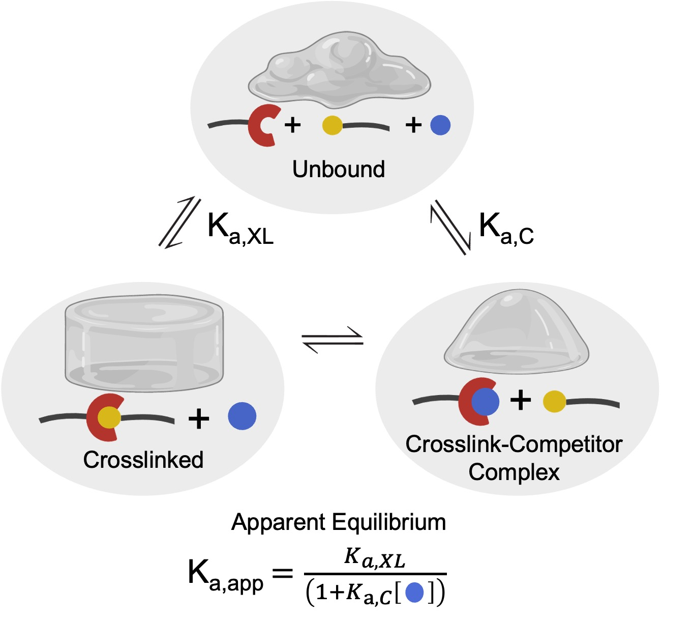

# InhibNet: Inhibition of Polymer Networks

Welcome! This app allows you to explore how **competitive inhibition** affects the mechanical properties of polymer networks.
Associated publication: TBD

## Quick Start

If you are super impatient here is the quick start for using this app.

Clone this repo and run the app:

```bash
git clone https://github.com/hill-lab-chem/InhibNet.git
cd InhibNet

# Create & activate virtual environment
python -m venv InhibNetEnv
source InhibNetEnv/bin/activate       # macOS / Linux
InhibNetEnv\Scripts\Activate.ps1      # Windows PowerShell

# Install dependencies
pip install -r requirements.txt

# Launch app
streamlit run INHIBNET_App.py
```
# Background on Work

This app allows you to explore how **competitive inhibition** affects the mechanical properties of polymer networks.

For more information about this tool, please read our associated publication (link coming soon).

For details about how the code works, visit our GitHub repository:  
👉 [https://github.com/hill-lab-chem/InhibNet/](https://github.com/hill-lab-chem/InhibNet/)

---

The purpose of this work is to quantify how a polymer network's material properties can be altered by adding a small molecule that can compete with a crosslink. It has long been shown in the literature that the material properties (i.e., modulus and relaxation time) of dynamic polymer networks are determined by the dynamics of the crosslink.  

We propose that adding a small molecule competitor can alter the dynamics of the crosslink through the strength of the competing interaction. In turn, the altered dynamics lead to a predictable change in material properties.  
This framework has been validated across boronate ester and hydrazone dynamic crosslinked networks, demonstrating predictive accuracy for both shear modulus and relaxation time.

We hypothesized that principles from enzyme competitive inhibition could be adapted to dynamic hydrogels to provide a similarly simple framework for predicting how key network properties change in the presence of competing species.  

In this analogy, the apparent equilibrium constant ($K_{a,app}$), commonly used in enzyme kinetics to describe effective binding affinities under competition, can be translated to dynamic networks as a predictor of mechanical response.  Due to the crosslinks existing in a ternary equilibrium among unbound strands, crosslinked pairs, and crosslink–competitor complexes, we reasoned that the association constants for crosslink formation ($K_{a,XL}$) and competitor binding ($K_{a,C}$) could be used within the $K_{a,app}$ framework to capture the effective network behavior.

**Figure:** Ternary equilibrium, allowing for the $K_{a,app}$ assumption  


---

## Equations

### 1. Crosslink Conversion

```math
p = \left(1 + \frac{1}{2 N_a K_{a,app}}\right) - \sqrt{\left(1 + \frac{1}{2 N_a K_{a,app}}\right)^2 - 1}
where:

- $p$ — crosslink conversion  
- $N_a$ — concentration of crosslinks in solution  

---

### 2. Shear Modulus (Affine Network)

Define the effective probability term:

$$
P_{out} = \sqrt{\frac{1}{p} - \frac{3}{4}} - \frac{1}{2}
$$

Then the probability that 3 crosslinks will form ($P_3$):

$$
P_3 = 4 P_{out} (1 - P_{out})^3
$$

Then the probability that 4 crosslinks will form ($P_4$):

$$
P_4 = (1 - P_{out})^4
$$

The elastically active chains ($v_e$) are:

$$
v_e = \frac{N_a}{4} \left(\frac{3}{2}P_3 + 2P_4 \right)
$$

The modulus is given by:

$$
\frac{G_p}{k_b T} = v_e
$$

---

### 3. Shear Modulus (Phantom Network)

For more dilute systems (close to the overlap concentration), it is more appropriate to use a phantom model for network elasticity, which accounts for the movement of strand junctions:

$$
\frac{G_p}{k_b T} = v_e - \mu_e
$$

where $\mu_e$ represents the number density of elastically active junctions:

$$
\mu_e = \frac{N_a}{4} (P_3 + P_4)
$$

Simplified modulus equation:

$$
G_p = \frac{N_a}{16} \left(3 - \sqrt{\frac{4}{p} - 3}\right)^3 \left(\sqrt{\frac{4}{p} - 3} + 1\right)
$$

---

### 4. Relaxation Time Prediction

The relaxation time ($\tau$) decreases with increasing competitor concentration due to disruption of elastically active crosslinks.  
We model this using a Langmuir-type decay relation scaled by the fraction of active strands ($v_e$):

$$
\tau(C) = \tau_0 - (\tau_0 - \tau_{min}) \left(\frac{2 v_e}{N_a}\right)
$$

where:  
- $\tau_0$ — relaxation time in the absence of competitor  
- $\tau_{min}$ — minimum $\tau$ value as competitor concentration approaches infinity  
- $v_e$ and $N_a$ — as defined above  

       
## Detailed Local Install Instructions

### 1) Install Python
- Install **Python 3.9+** from https://www.python.org/downloads/  
- On Windows, check **“Add Python to PATH”** during installation.
### 2) Download this repository and navigate to the path
- This repo can be downloaded from the green code button
   - Download zip
   - Then you can expand the zip file
   - It should be labeled as a folder "InhibNet-Main"
- Now we need to navigate to the folder "InhibNet-Main"
   - This can be done through Terminal, command line, etc.
- Navigate to the folder containing InhibNet:

```bash
cd /path/to/InhibNet-main
#note that this won't be your exact path, find where you saved the Inhib-Net folder in file explorer, or finder and you can copy the file path
```

### 3) Create a virtual environment named "InhibNetEnv"
- you can call this environment whatever you want here I call it InhibNetEnv
- note: some people may need to write "py" instead of python because of how your computer saved python
```bash
python -m venv InhibNetEnv
```

### 4) Activate your environment

- Windows (PowerShell)
```bash
InhibNetEnv\Scripts\Activate.ps1
```
- Windows (cmd)
```bash
InhibNetEnv\Scripts\activate.bat
```
- macOS / Linux
```bash
source InhibNetEnv/bin/activate 
```
- After activating your environment instead of something like (base) you will see (InhibNetEnv) at the start of each line of code
### 5) Install Dependencies
```
# Make sure your pip is up to date
python -m pip install --upgrade pip
```
```
# use the requirements file in the repository to make sure you have the required packages to run the app
pip install -r requirements.txt
```
### 6) Run the app
```
streamlit run INHIBNET_App.py
```
### 7) Running the app locally in the future
- Now that you have all the requirements ready, you can run the app with much fewer steps
- You simply need to activate your enviroment (step 4)
- Then run the app (step 6)
