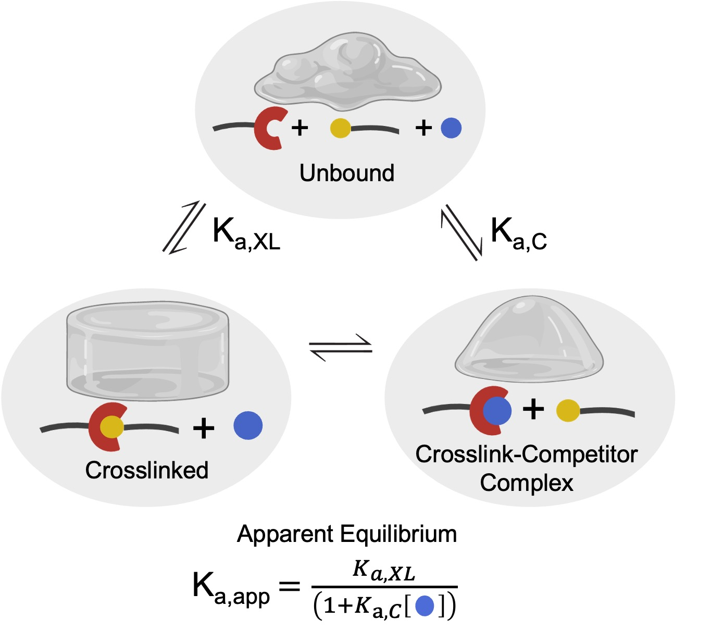

# InhibNet: Inhibition of Polymer Networks

Welcome! This app allows you to explore how **competitive inhibition** affects the mechanical properties of polymer networks.
Associated publication: TBD

## Quick Start

If you are super impatient here is the quick start for using this app:

Clone this repo and run the app:

```bash
git clone https://github.com/hill-lab-chem/InhibNet.git
cd InhibNet

# Create & activate virtual environment
python -m venv InhibNetEnv
source InhibNetEnv/bin/activate       # macOS / Linux
InhibNetEnv\Scripts\Activate.ps1      # Windows PowerShell

# Install dependencies
pip install -r requirements.txt

# Launch app
streamlit run INHIBNET_App.py
```
## Background on work
The purpose of this work is to quantify how a single polymer network can be altered by adding a small molecule that can compete with a crosslink.  
We hypothesized that principles from competitive inhibition of enzymes could be adapted to dynamic hydrogels to provide a simple framework for predicting how key network properties change in the presence of competing species.  

In particular, the apparent equilibrium ($K_{a,app}$), widely used in enzyme kinetics to capture effective affinities under competitive inhibition, can be directly translated to dynamic networks as a predictor of mechanical response.  
Crosslinks exist in a ternary equilibrium between unbound, crosslinked, and the crosslink-competitor complex. The association constants for the formation of the crosslink ($K_{a,XL}$) and the association of the competitor with the crosslink ($K_{a,C}$) feed into the $K_{a,app}$ assumption.

  
**Figure:** Ternary Equilibrium, allowing for the $K_{a,app}$ assumption

---

## Quantitative Model

We designed a quantitative model that inputs $K_{a,app}$ into **crosslink conversion ($p$, eqn. 1)**, which is then used to calculate the shear modulus for either the **Affine** or **Phantom** network model.  

- **Phantom network** captures defects well, especially for dilute systems.  
- **Affine network** better depicts material properties at high concentrations.

---

# Equations

## 1. Crosslink Conversion

The crosslink conversion is calculated as:

$$
p = \left(1 + \frac{1}{2 N_a K_{a,app}}\right) - \sqrt{\left(1 + \frac{1}{2 N_a K_{a,app}}\right)^2 - 1}
$$

## 2. Shear Modulus (Affine Network)

First, define the effective probability term:

$$
P_{out} = \sqrt{\frac{1}{p} - \frac{3}{4}} - \frac{1}{2}
$$

The probability that 3 crosslinks will form:

$$
P_{3} = 4 P_{out} (1-P_{out})^3
$$

The probability that 4 crosslinks will form:

$$
P_{4} = (1-P_{out})^4
$$

The elastically active strands are:

$$
v_{e} = \frac{N_a}{4} \left(\frac{3}{2} P_3 + 2 P_4 \right)
$$

The modulus is then:

$$
\frac{g_0}{K_b T} = v_{e}
$$

## 3. Shear Modulus (Phantom Network)

The phantom network corrects for the concentration of crosslinks:

$$
\frac{g_0}{K_b T} = v_{e} - \mu
$$

where $\mu$ is the concentration of crosslinks.

This equation can be simplified as:

$$
g_0 = \frac{N_a}{16} \left(3 - \sqrt{\frac{4}{p} - 3}\right)^3 \left(\sqrt{\frac{4}{p} - 3} + 1\right)
$$

---


## Main Tools

1. **Modulus Surface Visualization**  
   Input features like crosslink association ($K_{a,XL}$), concentration of crosslinks ($N_a$), competitor association ($K_{a,C}$), and competitor concentration ([C]).  
   Plots modulus vs. $K_{a,C}$ vs. [C] interactively.

2. **Modulus vs Competitor Concentration**  
   2D plot showing modulus changes with a single competitor. Allows CSV download of predictions.

3. **Modulus vs $K_{a,C}$**  
   Tool to predict either $K_{a,C}$ or $K_{a,XL}$ from experimental modulus and concentration data.

---

## Network Models

- **Phantom Network** – accounts for network fluctuations, best for dilute networks.  
- **Affine Network** – assumes fully connected network, best for concentrated networks.

---

## Instructions

### 1) Install Python
- Install **Python 3.9+** from https://www.python.org/downloads/  
- On Windows, check **“Add Python to PATH”** during installation.
### 2) Create & Activate a Virtual Environment
```bash
# Navigate to the folder containing your .py file
cd /path/to/your/project

# Create a virtual environment named "InhibNetEnv"
python -m venv InhibNetEnv

# Windows (PowerShell)
InhibNetEnv\Scripts\Activate.ps1

# Windows (cmd)
InhibNetEnv\Scripts\activate.bat

# macOS / Linux
source InhibNetEnv/bin/activate 
```
### 3) Install Dependencies
```
# Optional but recommended
python -m pip install --upgrade pip

# use the requirements file in
pip install -r requirements.txt

# Or install packages directly:
pip install streamlit numpy matplotlib scipy plotly pandas scikit-learn
```
### 4) Run the app
```
streamlit run INHIBNET_App.py
```
